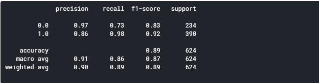
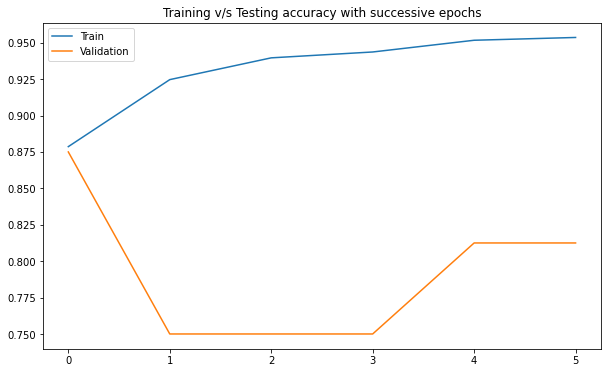

# Pneumonia-DL
This notebook uses Transfer Learning to detect Pneumonia from X-ray Images. The model uses VGG16 for feature extraction and Dense layers for classification.

### Dataset
The Dataset used for the model is name `Chest X-Ray Images (Pneumonia)`
<pre>
Dataset Link   : <a href="https://www.kaggle.com/paultimothymooney/chest-xray-pneumonia">Chest X-Ray Images (Pneumonia)</a>
Original Paper : <a href=https://www.cell.com/cell/fulltext/S0092-8674(18)30154-5>Identifying Medical Diagnoses and Treatable Diseases by Image-Based Deep Learning</a>
                   (Daniel S. Kermany, Michael Goldbaum, Wenjia Cai, M. Anthony Lewis, Huimin Xia, Kang Zhang)
  
No of Classes  : 2
Distribution of Images : Total      : 5856 
                         Training   : 5216 
                         Validation : 16 
                         Testing    : 624
</pre>        

#### Sample Images

### Model Details
Library used    : Keras
Optimizer       : Adam
Batch Size      : 32
Number of Epochs: 10

### Output
#### Classification Report

#### Accuracy Plot

#### Loss Plot

